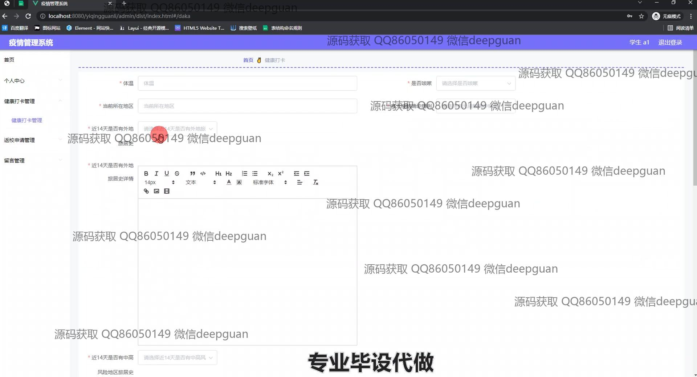

<h1 align="center">基于javaweb的疫情管理系统的设计与实现+vue</h1>

## 简介
疫情管理系统：角色分为管理员、老师和学生；功能包括个人信息管理、健康打卡、返校申请、班级类型管理、留言管理、学生与教师信息管理等模块。    --计算机毕业设计源码；毕设源码；java毕业设计源码

## 联系方式

<h3 align="center">获取完整代码与数据库文件 + 微信：deepguan QQ: 86050149 QQ群: 783742310</h3>

<h3 align="center">可帮忙远程部署 包运行成功！提供远程部署、修改代码、设计文档指导、代码讲解等服务！</h3>

## 功能介绍（完整见运行截图）
管理员：主要功能包括登录、注销、用户角色管理，以及处理返回校园申请和健康打卡记录的审核。可访问后台管理页面，管理教师和学生的数据，包括增删查改用户信息，查看和回复留言，进行数据的筛选与查询。导航菜单提供个人中心和各个管理模块的入口，界面设计简洁，便于进行疫情期间的数据管理和沟通。  
教师：可以登录系统查看和管理所在班级学生的健康打卡记录，参与返校申请的评审过程。提供输入体温、地理位置等健康信息的表单，便于记录和追踪疫情相关数据。能够查看和回复学生留言，通过搜索栏筛选学生信息，简化了信息管理的流程。此外，可访问个人中心，管理和更新自己的个人信息。  
学生：通过登录页面进入系统，填写个人信息和健康状况的打卡记录，包括体温、隔离状态、旅游史等信息。可以提交返校申请，输入返校时间、地点及原因，还能通过系统进行个人信息的查看与修改。学生也能提交留言并通过个人中心模块查看健康打卡记录，将疫情期间的重要信息实时报告和反馈。

## 运行截图

本代码来源于网络,仅供学习参考使用!

